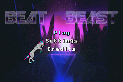
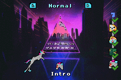
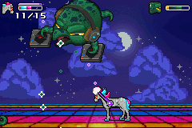
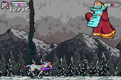
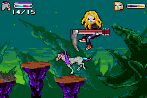

# BeatBeast

...by _Afska_ & _Lu_ & _Synthenia_.

This is our entry for the [GBA Jam 2024](https://itch.io/jam/gbajam24)!








## Install

The game uses [a fork](https://github.com/GValiente/butano/compare/17.7.0...afska:butano:custom_audio) of the **Butano** engine (created from its `v17.7.0` version) that disables its audio player, so we can use [gsmplayer-gba](https://github.com/pinobatch/gsmplayer-gba) for UI music and a custom player that plays PCM audio for main gameplay. The forked engine code is included here for simplicity, so users only have to clone this repository in order to compile the game.

The ROM file submitted to the jam was compiled using the latest devkitARM version available at the time (GCC `14.1.0`). It generates a _32760 KB_ file, very close to the _32 MB_ limit, so future devkitARM versions might not compile if they generate bigger code.

```bash
# This assumes WSL2 on Windows, but it should be similar in other *nix environments.
cd ~

# Install toolchain
sudo apt update
sudo apt install git python3 python-is-python3
wget https://apt.devkitpro.org/install-devkitpro-pacman
chmod +x ./install-devkitpro-pacman
sudo ./install-devkitpro-pacman
sudo dkp-pacman -Sy
sudo dkp-pacman -Syu
sudo dkp-pacman -S gba-dev
# [!] manual: restart shell

# Clone the repository
git clone https://github.com/afska/beat-beast
cd beat-beast/

# Compile
make -j$(nproc)
# (this will generate a beat-beast.out.gba ROM file)

# --- optional ---
# to update boss scripts:
make rebuild # the `rebuild` target builds the levels && the code
# (requires extra development tools, like node)
```

### Development scripts

### Install required tools

```bash
# [!] manual: install nvm / node 18
sudo apt install gimp -y
sudo apt install -y imagemagick-6.q16
```

### Import levels

```bash
cd importer/
# [!] first time: npm install
node src/importer.js
# (generates `*.boss` files in `gbfs_files`)
```

### Export sprites

```bash
make sprites XCF=dj
# (exports individual sprites to `graphics/` from `graphics/sprites/dj.xcf`)
```

### Build music

```bash
# GSM
ffmpeg -y -i input.wav -ac 1 -af 'aresample=18157' -strict unofficial -c:a gsm output.gsm
ffplay -ar 18157 output.gsm
# PCM
ffmpeg -y -i input.wav -ac 1 -ar 36314 -f s8 output.pcm
ffplay -ar 36314 -f s8 output.pcm
# Batch convert:
for file in *.wav; do
  output="${file%.wav}.pcm"
  ffmpeg -y -i "$file" -ac 1 -ar 36314 -f s8 "$output"
done
```

### Build background videos

```bash
ffmpeg -y -i "input.mp4" -r 30 "output_%05d.png"
for file in *.png; do
  magick $file -resize 240x160! -colors 253 -unique-colors tmpPalette.bmp && magick importer/black.bmp tmpPalette.bmp +append tmpPalette.bmp && magick $file -resize 240x160! -background black -gravity northwest -extent 256x256 -colors 253 -remap tmpPalette.bmp "$file" && rm tmpPalette.bmp
done
for file in *.png; do
  output="${file%.png}.bmp"
  magick "$file" -define bmp:format=bmp3 -compress None -type Palette "$output"
done
```

### Build preview videos

```bash
ffmpeg -y -i "input.mp4" -r 30 -vf "scale=64:64:flags=neighbor" "preview_%03d.png"
# -> use triangle.png from graphics/sprites/triangle.png
for file in preview_*.png; do
  ffmpeg -y -i "$file" -i triangle.png -filter_complex "[0:v][1:v]alphamerge, format=yuva420p, lut=a=val*255" "$file"
done
# [!] manual: only keep 150 frames (5 seconds loop), then set `start` and `end` in the next command
start=188; end=337; for i in $(seq $start $end); do mv "preview_$(printf "%03d" $i).png" "preview_$(printf "%03d" $(($i - $start))).png"; done
ffmpeg -y -i "preview_%03d.png" -filter_complex "tile=1x150" "preview.png"
```

## VS Code settings

**Extensions**: _C/C++, EditorConfig for VS Code_

**Preferences**: _Open User Settings (JSON)_

```json
{
  "C_Cpp.clang_format_style": "{ BasedOnStyle: Chromium }",
  "editor.formatOnSave": true
}
```

## Troubleshooting

### Link errors

If you've added new folders, ensure they're in Makefile's SOURCES list!
